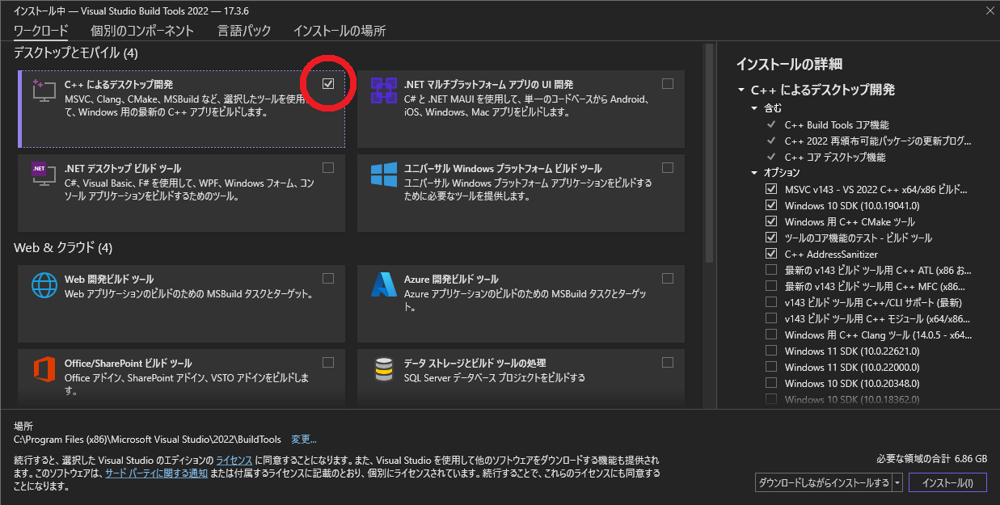

# How to install InsightFace in a Python virtual environment


## ***!Attention!***
*Recommend creating a new Python virtual environment because the installation of A by pip may affect previous packages.*

## Requirements
* **Microsoft Visual C++** 14.0 or higher version
* The following Python packages:
    * **Cython**
    * **ONNX Runtime**

## Procedure
1. Install **Microsoft C++ Build Tools** to install **Microsoft Visual C++**
    > Download Link: [Microsoft C++ Build Tools](https://visualstudio.microsoft.com/visual-cpp-build-tools/)
2. Install **Microsoft Visual C++** with the **Microsoft C++ Build Tools**

   (* *Check the box that is surrounded by the red circle as follows:*)

3. Create a new Python virtual environment and activate it on the Anaconda Prompt
4. Execute the following commands on the Anaconda Prompt:
    ```
    pip install Cython
    pip install onnxruntime
    pip install insightface
    pip install opencv-python-headless==4.5.5.64
    pip uninstall opencv-python-headless
    pip uninstall opencv-python
    pip install opencv-python==4.5.5.64
    ```
    (* *The reason why execute the last four-pip commands is that we can’t execute cv2 methods because of the opencv-python-headless package, which is installed at the same time when is installed InsightFace*)